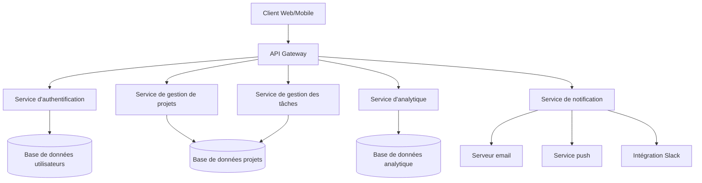
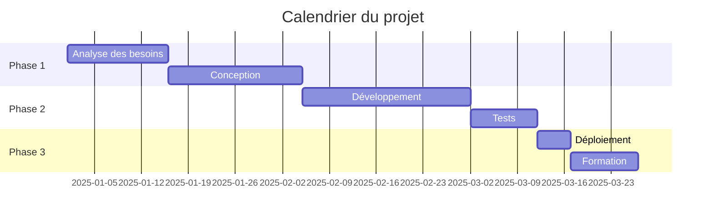

# Cours sur le Markdown : Documentation et Utilisation

Bonjour Émile ! Je vais vous proposer un cours complet sur le format Markdown, en commençant par les bases et en progressant vers des concepts plus avancés. Ce cours inclura de nombreux exemples, notamment autour du thème du suivi de progression de projet.

## Introduction au Markdown

Le Markdown est un langage de balisage léger créé en 2004 par John Gruber et Aaron Swartz. Son objectif principal est de permettre la rédaction de textes formatés avec une syntaxe simple et lisible, sans avoir besoin d'utiliser des balises HTML complexes.

Un fichier Markdown (extension `.md`) est un fichier texte qui contient du texte formaté selon cette syntaxe. Il peut être converti en HTML, PDF, et d'autres formats pour l'affichage final.

### Pourquoi utiliser Markdown ?

- **Simplicité** : Facile à apprendre et à utiliser
- **Lisibilité** : Le texte reste lisible même sans formatage
- **Portabilité** : Compatible avec de nombreuses plateformes
- **Versatilité** : Peut être converti en divers formats (HTML, PDF, DOCX...)
- **Efficacité** : Permet de se concentrer sur le contenu plutôt que sur la mise en forme

## Les bases du Markdown

Commençons par les éléments fondamentaux du Markdown.

### 1. Titres et sous-titres

Les titres sont créés en utilisant le caractère `#`. Le nombre de `#` détermine le niveau du titre.

```markdown
# Titre de niveau 1
## Titre de niveau 2
### Titre de niveau 3
#### Titre de niveau 4
##### Titre de niveau 5
###### Titre de niveau 6
```

<details>
<summary> Appuyez ici pour voir un aperçu du résultat</summary>


# Titre de niveau 1
## Titre de niveau 2
### Titre de niveau 3
#### Titre de niveau 4
##### Titre de niveau 5
###### Titre de niveau 6


</details>


### 2. Formatage de texte

```markdown
*Texte en italique* 
 _Texte en italique_
**Texte en gras** 
__Texte en gras__
***Texte en gras et italique***
 ___Texte en gras et italique___
~~Texte barré~~
```

<details>
<summary> Appuyez ici pour voir un aperçu du résultat</summary>


*Texte en italique*

_Texte en italique_

**Texte en gras**  

__Texte en gras__

***Texte en gras et italique*** 

___Texte en gras et italique__

~~Texte barré~~


</details>


### 3. Listes

**Liste non ordonnée** :
```markdown
- Élément 1
- Élément 2
  - Sous-élément 2.1
  - Sous-élément 2.2
- Élément 3
```

**Liste ordonnée** :
```markdown
1. Premier élément
2. Deuxième élément
   1. Sous-élément 2.1
   2. Sous-élément 2.2
3. Troisième élément
```

### 4. Liens

```markdown
[Texte du lien](https://www.example.com)
[Texte du lien avec titre](https://www.example.com "Titre qui apparaît au survol")
```

### 5. Images

```markdown


```

### 6. Citations

```markdown
> Ceci est une citation.
> 
> Elle peut s'étendre sur plusieurs lignes.
```

### 7. Lignes horizontales

```markdown
---
***
___
```

### 8. Code

**Code en ligne** :
```markdown
Voici du `code en ligne`.
```

**Blocs de code** :
````markdown
```
Bloc de code sans coloration syntaxique
```

```python
# Bloc de code avec coloration syntaxique pour Python
def hello_world():
    print("Hello, world!")
```
````

## Éléments avancés du Markdown

Passons maintenant à des fonctionnalités plus avancées.

### 9. Tableaux

```markdown
| En-tête 1 | En-tête 2 | En-tête 3 |
|-----------|-----------|-----------|
| Cellule 1 | Cellule 2 | Cellule 3 |
| Cellule 4 | Cellule 5 | Cellule 6 |
```

Vous pouvez aligner le contenu des colonnes :

```markdown
| Aligné à gauche | Centré | Aligné à droite |
|:----------------|:------:|----------------:|
| Texte           | Texte  | Texte           |
```

### 10. Listes de tâches

```markdown
- [x] Tâche complétée
- [ ] Tâche à faire
- [ ] Autre tâche à faire
```

### 11. Notes de bas de page

```markdown
Voici une phrase avec une note de bas de page[^1].

[^1]: Contenu de la note de bas de page.
```

### 12. Liens de référence

```markdown
Voici un [lien par référence][ref].

[ref]: https://www.example.com "Titre optionnel"
```

### 13. Échappement de caractères spéciaux

```markdown
\*Ceci n'est pas en italique\*
```

### 14. HTML intégré

Le Markdown permet d'utiliser directement des balises HTML :

```markdown
<div style="color: red;">
  Ce texte est en rouge grâce à une balise HTML.
</div>
```

### 15. Définitions

```markdown
Terme
: Définition du terme
```

## Extensions et variantes du Markdown

Différentes implémentations de Markdown offrent des fonctionnalités supplémentaires :

### 16. GitHub Flavored Markdown (GFM)

GitHub a étendu Markdown avec des fonctionnalités comme :

- Les listes de tâches (déjà mentionnées)
- Les tableaux (déjà mentionnés)
- La mise en évidence de code avec coloration syntaxique
- Les mentions d'utilisateurs (@utilisateur)
- Les références à des issues (#123)
- Les emojis (:smile:)

### 17. Markdown Extra

Cette variante ajoute :

- Les attributs de bloc
- Les définitions (déjà mentionnées)
- Les tableaux avec en-têtes abrégés
- Les notes de bas de page (déjà mentionnées)

### 18. Diagrammes avec Mermaid ou PlantUML

Certains systèmes prennent en charge la création de diagrammes :

````markdown

````

## Application pratique : Suivi de progression d'un projet

Voyons maintenant comment utiliser Markdown pour créer un outil de suivi de progression de projet.

### Exemple 1 : Structure de base d'un document de suivi de projet

```markdown
# Projet : Refonte du site web

## Informations générales
- **Client** : Entreprise XYZ
- **Date de début** : 15 mars 2025
- **Date de fin prévue** : 30 juin 2025
- **Chef de projet** : Jean Dupont

## État d'avancement


## Tâches

### Phase 1 : Analyse et conception
- [x] Réunion de lancement
- [x] Analyse des besoins
- [x] Création des wireframes
- [ ] Validation des maquettes

### Phase 2 : Développement
- [ ] Intégration HTML/CSS
- [ ] Développement back-end
- [ ] Tests unitaires

### Phase 3 : Déploiement
- [ ] Tests d'acceptation
- [ ] Migration des données
- [ ] Mise en production

## Journal des modifications
| Date | Description | Responsable |
|------|-------------|-------------|
| 15/03/2025 | Lancement du projet | Jean D. |
| 22/03/2025 | Finalisation de l'analyse | Sophie M. |
| 05/04/2025 | Validation des wireframes | Client |
```

### Exemple 2 : Tableau de bord de projet avancé

Voici un exemple plus complexe et détaillé :

```markdown
# Tableau de bord du projet : Système de gestion de contenu

## 📊 Vue d'ensemble
**Statut global :** 🟡 En cours
**Progression :** ▓▓▓▓▓▓▓▓▓▓▓▓▓▓▓░░░░░ 75%
**Santé du projet :** 🟢 Bonne

## 📋 Informations clés
| Métrique | Valeur |
|:---------|:-------|
| Date de début | 01/02/2025 |
| Date de fin prévue | 15/07/2025 |
| Budget | 75 000 € |
| Budget consommé | 52 500 € (70%) |
| Risques actifs | 3 |
| Problèmes en cours | 1 |

## 📝 Description
Ce projet vise à développer un système de gestion de contenu personnalisé pour le département marketing, permettant une publication multicanal et une analyse de performance intégrée.

## 🎯 Objectifs
- Réduire le temps de publication de 60%
- Augmenter l'engagement sur les réseaux sociaux de 25%
- Centraliser la gestion de contenu pour tous les canaux

## 👥 Équipe
- **Chef de projet :** Marie Lambert
- **Développeurs :** 
  - Jean Dupont (Front-end)
  - Sophie Martin (Back-end)
  - Ahmed Benali (API)
- **Designers :** 
  - Claire Dubois (UX)
  - Thomas Lefèvre (UI)
- **Testeurs :** 
  - Lucie Moreau
  - Paul Petit

## 📈 Progression par module

### Module 1 : Authentification et gestion des utilisateurs
- [x] Conception du système de rôles et permissions
- [x] Implémentation de l'authentification
- [x] Tests de sécurité
- [x] Documentation utilisateur
> **Progression :** 100% ✅

### Module 2 : Éditeur de contenu
- [x] Conception de l'interface
- [x] Implémentation de l'éditeur WYSIWYG
- [x] Gestion des médias
- [ ] Fonctionnalités avancées (versionnage)
> **Progression :** 85% 🟢

### Module 3 : Publication multicanal
- [x] Intégration avec les réseaux sociaux
- [ ] Planification des publications
- [ ] Prévisualisation par canal
- [ ] API pour partenaires externes
> **Progression :** 60% 🟡

### Module 4 : Analyse et rapports
- [ ] Tableau de bord analytique
- [ ] Rapports personnalisés
- [ ] Export de données
- [ ] Intégration avec Google Analytics
> **Progression :** 25% 🔴

## ⚠️ Risques et problèmes

### Risques actifs
| ID | Description | Impact | Probabilité | Stratégie d'atténuation |
|----|-------------|--------|------------|------------------------|
| R01 | Retard dans l'intégration des API tierces | Moyen | Élevée | Développer des simulateurs pour tests |
| R02 | Problèmes de performance avec de grands volumes | Élevé | Moyenne | Tests de charge précoces |
| R03 | Changements dans les API des réseaux sociaux | Moyen | Moyenne | Architecture modulaire adaptable |

### Problèmes en cours
| ID | Description | Impact | Priorité | Responsable | Date limite |
|----|-------------|--------|----------|------------|------------|
| P01 | Incompatibilité avec IE11 | Faible | Moyenne | Jean D. | 30/05/2025 |

## 📅 Jalons

| Jalon | Date prévue | Statut |
|-------|------------|--------|
| Validation de la conception | 01/03/2025 | ✅ Terminé |
| Alpha interne | 15/04/2025 | ✅ Terminé |
| Bêta avec utilisateurs clés | 01/06/2025 | 🟡 En cours |
| Lancement v1.0 | 15/07/2025 | ⚪ À venir |

## 📝 Notes de réunion récentes

### Réunion hebdomadaire - 10/05/2025
Participants : Marie L., Jean D., Sophie M., Claire D.

#### Points discutés
1. Progression du module d'analyse
2. Problème de compatibilité IE11
3. Planification des tests utilisateurs

#### Actions à suivre
- [ ] Sophie : Accélérer le développement des rapports personnalisés
- [ ] Jean : Proposer solution pour IE11 d'ici vendredi
- [ ] Marie : Contacter les utilisateurs pour la phase bêta

## 📚 Documentation
- [Spécifications techniques](docs/specs.pdf)
- [Guide utilisateur](docs/user-guide.pdf)
- [Architecture système](docs/architecture.pdf)

---

*Dernière mise à jour : 15/05/2025 par Marie Lambert*
```

## Exemple complexe et détaillé : Documentation technique d'un projet avec Markdown

Voici un exemple particulièrement détaillé qui combine de nombreuses fonctionnalités Markdown pour créer une documentation technique complète :

````markdown
# Documentation technique : Plateforme de suivi de projet "ProjectTrack"
*Version 2.5.3 - Mise à jour le 15 mai 2025*

<div align="center">
  
  
  [](https://projecttrack.example.com)
  [](https://github.com/example/projecttrack/releases)
  [](LICENSE)
</div>

## Table des matières

- [Introduction](#introduction)
- [Architecture](#architecture)
- [Installation](#installation)
  - [Prérequis](#prérequis)
  - [Configuration](#configuration)
  - [Déploiement](#déploiement)
- [Guide d'utilisation](#guide-dutilisation)
  - [Tableau de bord](#tableau-de-bord)
  - [Gestion des projets](#gestion-des-projets)
  - [Suivi de progression](#suivi-de-progression)
  - [Rapports](#rapports)
- [API](#api)
- [Dépannage](#dépannage)
- [Foire aux questions](#foire-aux-questions)
- [Annexes](#annexes)

---

## Introduction

**ProjectTrack** est une plateforme complète de suivi de projet conçue pour optimiser la gestion des ressources, le suivi des tâches et la communication au sein des équipes. Cette documentation technique détaille l'architecture, l'installation et l'utilisation de la plateforme.

> "ProjectTrack a transformé notre façon de gérer les projets complexes, nous permettant de réduire les délais de 30% tout en améliorant la qualité des livrables." — *Marie Dupont, Directrice de projet chez Acme Inc.*

### Fonctionnalités principales

- ✅ Suivi en temps réel de l'avancement des projets
- ✅ Gestion des ressources et allocation optimisée
- ✅ Tableaux de bord personnalisables avec KPIs
- ✅ Système avancé de notification et d'alerte
- ✅ Intégration avec les outils courants (Jira, GitHub, Slack)
- ✅ API complète pour extensions personnalisées

---

## Architecture

ProjectTrack utilise une architecture microservices pour garantir évolutivité et résilience.

### Diagramme d'architecture



### Pile technologique

| Couche | Technologies |
|--------|--------------|
| Frontend | React, Redux, Material-UI |
| Backend | Node.js, Express, GraphQL |
| Bases de données | PostgreSQL, MongoDB, Redis |
| Déploiement | Docker, Kubernetes, AWS |
| CI/CD | Jenkins, GitHub Actions |
| Monitoring | Prometheus, Grafana, ELK Stack |

---

## Installation

### Prérequis

Avant d'installer ProjectTrack, assurez-vous que votre système répond aux exigences suivantes :

- **Système d'exploitation :** Linux (Ubuntu 20.04+ recommandé), macOS, Windows Server 2019+
- **Docker :** version 20.10+
- **Docker Compose :** version 2.0+
- **Kubernetes :** version 1.22+ (pour déploiement en production)
- **Espace disque :** 20 Go minimum
- **RAM :** 8 Go minimum (16 Go recommandé)

### Configuration

1. Clonez le dépôt :
   ```bash
   git clone https://github.com/example/projecttrack.git
   cd projecttrack
   ```

2. Copiez le fichier de configuration d'exemple :
   ```bash
   cp .env.example .env
   ```

3. Modifiez le fichier `.env` avec vos paramètres :
   ```
   # Configuration de base
   APP_NAME=ProjectTrack
   APP_ENV=production
   APP_DEBUG=false
   APP_URL=https://votre-domaine.com
   
   # Configuration de la base de données
   DB_CONNECTION=pgsql
   DB_HOST=127.0.0.1
   DB_PORT=5432
   DB_DATABASE=projecttrack
   DB_USERNAME=votre_utilisateur
   DB_PASSWORD=votre_mot_de_passe
   
   # Configuration email
   MAIL_DRIVER=smtp
   MAIL_HOST=smtp.votre-service.com
   MAIL_PORT=587
   MAIL_USERNAME=votre_email@exemple.com
   MAIL_PASSWORD=votre_mot_de_passe
   MAIL_ENCRYPTION=tls
   ```

4. Générez les clés d'API et de chiffrement :
   ```bash
   ./scripts/generate-keys.sh
   ```

### Déploiement

#### Déploiement avec Docker Compose (développement)

```bash
docker-compose up -d
```

#### Déploiement sur Kubernetes (production)

1. Configurez votre cluster Kubernetes :
   ```bash
   kubectl apply -f kubernetes/namespace.yaml
   kubectl apply -f kubernetes/secrets.yaml
   kubectl apply -f kubernetes/configmap.yaml
   ```

2. Déployez les services :
   ```bash
   kubectl apply -f kubernetes/services/
   ```

3. Déployez les déploiements :
   ```bash
   kubectl apply -f kubernetes/deployments/
   ```

4. Vérifiez que tous les pods sont en cours d'exécution :
   ```bash
   kubectl get pods -n projecttrack
   ```

---

## Guide d'utilisation

### Tableau de bord

Le tableau de bord est l'écran principal de ProjectTrack, offrant une vue d'ensemble de tous vos projets.


#### Personnalisation du tableau de bord

Vous pouvez personnaliser votre tableau de bord en suivant ces étapes :

1. Cliquez sur l'icône ⚙️ en haut à droite
2. Sélectionnez "Personnaliser le tableau de bord"
3. Faites glisser et déposez les widgets souhaités
4. Configurez chaque widget selon vos besoins
5. Cliquez sur "Enregistrer"

### Gestion des projets

La section de gestion des projets vous permet de créer, modifier et suivre vos projets.

#### Création d'un nouveau projet

1. Accédez à la section "Projets"
2. Cliquez sur le bouton "+ Nouveau projet"
3. Remplissez le formulaire avec les informations du projet :
   - Nom du projet
   - Description
   - Date de début et de fin
   - Budget
   - Équipe
4. Définissez la structure WBS (Work Breakdown Structure)
5. Configurez les jalons
6. Cliquez sur "Créer"

### Suivi de progression

Le suivi de progression est au cœur de ProjectTrack. Il vous permet de visualiser l'avancement de vos projets et de vos tâches.

#### Diagramme de Gantt

Le diagramme de Gantt vous permet de visualiser la chronologie de votre projet :



#### Indicateurs de performance

ProjectTrack calcule automatiquement les indicateurs de performance clés (KPI) pour vos projets :

| Indicateur | Formule | Interprétation |
|------------|---------|----------------|
| SPI (Schedule Performance Index) | EV / PV | >1: En avance, =1: Dans les temps, <1: En retard |
| CPI (Cost Performance Index) | EV / AC | >1: Sous le budget, =1: Dans le budget, <1: Sur le budget |
| EAC (Estimate At Completion) | BAC / CPI | Estimation du coût final du projet |

Où :
- EV (Earned Value) = % d'achèvement × Budget total
- PV (Planned Value) = % planifié × Budget total
- AC (Actual Cost) = Coût réel à ce jour
- BAC (Budget At Completion) = Budget total du projet

### Rapports

ProjectTrack offre une variété de rapports pour analyser la performance de vos projets.

#### Types de rapports disponibles

- Rapport d'avancement hebdomadaire
- Rapport financier
- Rapport de charge de ressources
- Rapport de risques
- Rapport de qualité

#### Génération d'un rapport personnalisé

```javascript
// Exemple d'utilisation de l'API pour générer un rapport personnalisé
const customReport = await api.reports.generate({
  projectId: 'PRJ-2025-001',
  type: 'performance',
  dateRange: {
    start: '2025-01-01',
    end: '2025-03-31'
  },
  metrics: ['spi', 'cpi', 'eac'],
  groupBy: 'week',
  format: 'pdf'
});

console.log(`Rapport généré: ${customReport.url}`);
```

---

## API

ProjectTrack expose une API RESTful complète pour l'intégration avec d'autres systèmes.

### Authentification

L'API utilise l'authentification OAuth 2.0. Pour obtenir un jeton d'accès :

```bash
curl -X POST https://api.projecttrack.com/oauth/token \
  -H "Content-Type: application/json" \
  -d '{
    "client_id": "votre_client_id",
    "client_secret": "votre_client_secret",
    "grant_type": "client_credentials"
  }'
```

### Endpoints principaux

| Endpoint | Méthode | Description |
|----------|---------|-------------|
| `/api/v1/projects` | GET | Liste tous les projets |
| `/api/v1/projects/{id}` | GET | Récupère les détails d'un projet |
| `/api/v1/projects` | POST | Crée un nouveau projet |
| `/api/v1/projects/{id}` | PUT | Met à jour un projet existant |
| `/api/v1/projects/{id}` | DELETE | Supprime un projet |
| `/api/v1/tasks` | GET | Liste toutes les tâches |
| `/api/v1/reports` | POST | Génère un rapport |

### Exemple de requête

```bash
curl -X GET https://api.projecttrack.com/api/v1/projects \
  -H "Authorization: Bearer votre_token_access" \
  -H "Content-Type: application/json"
```

### Exemple de réponse

```json
{
  "data": [
    {
      "id": "PRJ-2025-001",
      "name": "Refonte du site web",
      "description": "Modernisation complète du site web corporate",
      "start_date": "2025-01-15",
      "end_date": "2025-06-30",
      "status": "in_progress",
      "progress": 45,
      "budget": {
        "planned": 150000,
        "actual": 65000
      },
      "team": [
        {
          "id": "USR-001",
          "name": "Jean Dupont",
          "role": "Chef de projet"
        },
        {
          "id": "USR-002",
          "name": "Marie Martin",
          "role": "Développeur"
        }
      ]
    }
  ],
  "meta": {
    "current_page": 1,
    "total_pages": 5,
    "total_count": 42
  }
}
```

---

## Dépannage

### Problèmes courants

#### Le serveur ne démarre pas

**Symptôme** : Le serveur ne démarre pas et affiche une erreur de connexion à la base de données.

**Solution** :
1. Vérifiez que votre base de données est en cours d'exécution :
   ```bash
   docker ps | grep postgres
   ```
2. Vérifiez les informations de connexion dans le fichier `.env`
3. Assurez-vous que l'utilisateur de la base de données a les permissions nécessaires

#### Erreurs d'authentification API

**Symptôme** : Les requêtes API renvoient une erreur 401 Unauthorized.

**Solution** :
1. Vérifiez que votre jeton d'accès n'a pas expiré
2. Régénérez un nouveau jeton
3. Assurez-vous que le client API a les permissions nécessaires

### Journaux de diagnostic

Les journaux de ProjectTrack se trouvent dans les emplacements suivants :

- **Application** : `/var/log/projecttrack/app.log`
- **API** : `/var/log/projecttrack/api.log`
- **Base de données** : `/var/log/projecttrack/db.log`

Pour consulter les journaux en temps réel :

```bash
tail -f /var/log/projecttrack/app.log
```

---

## Foire aux questions

### Questions générales

<details>
<summary><strong>Q : Combien d'utilisateurs ProjectTrack peut-il gérer ?</strong></summary>
<p>
ProjectTrack est conçu pour être hautement évolutif. Dans sa configuration standard, il peut gérer jusqu'à 10 000 utilisateurs actifs. Pour des déploiements plus importants, des configurations spécifiques sont nécessaires.
</p>
</details>

<details>
<summary><strong>Q : ProjectTrack est-il compatible avec les méthodologies agiles ?</strong></summary>
<p>
Oui, ProjectTrack prend en charge les méthodologies agiles comme Scrum et Kanban, ainsi que les approches traditionnelles comme Waterfall. Vous pouvez configurer le système selon votre méthodologie préférée.
</p>
</details>

### Questions techniques

<details>
<summary><strong>Q : Puis-je héberger ProjectTrack sur site ?</strong></summary>
<p>
Oui, ProjectTrack peut être déployé sur site, dans le cloud, ou dans un environnement hybride. La documentation d'installation fournit des instructions pour chaque scénario.
</p>
</details>

<details>
<summary><strong>Q : Quelles sont les exigences de sauvegarde ?</strong></summary>
<p>
Nous recommandons des sauvegardes quotidiennes de la base de données et des sauvegardes hebdomadaires complètes du système. Le script <code>backup.sh</code> dans le répertoire <code>scripts</code> peut être configuré pour s'exécuter automatiquement via cron.
</p>
</details>

---

## Annexes

### A. Glossaire des termes

| Terme | Définition |
|-------|------------|
| WBS | Work Breakdown Structure - Décomposition hiérarchique du travail en éléments plus petits et plus faciles à gérer |
| KPI | Key Performance Indicator - Indicateur clé de performance utilisé pour évaluer le succès d'une activité |
| SPI | Schedule Performance Index - Indice de performance du calendrier |
| CPI | Cost Performance Index - Indice de performance des coûts |
| EVM | Earned Value Management - Méthode de gestion de la valeur acquise |

### B. Références

1. [Guide PMBOK](https://www.pmi.org/pmbok-guide-standards)
2. [Documentation Docker](https://docs.docker.com/)
3. [Documentation Kubernetes](https://kubernetes.io/docs/)
4. [Spécification GraphQL](https://graphql.org/learn/)

### C. Historique des versions

| Version | Date | Description |
|---------|------|-------------|
| 1.0.0 | 15/01/2024 | Version initiale |
| 2.0.0 | 10/06/2024 | Refonte majeure avec architecture microservices |
# Cours sur le Markdown : Documentation et Utilisation (Suite)

Bien sûr Émile, voici la suite du cours sur Markdown. Continuons avec la fin de notre exemple complexe et les sections suivantes.

## Suite de l'exemple complexe et détaillé (suite)

````markdown
### C. Historique des versions (suite)

| Version | Date | Description |
|---------|------|-------------|
| 1.0.0 | 15/01/2024 | Version initiale |
| 2.0.0 | 10/06/2024 | Refonte majeure avec architecture microservices |
| 2.5.0 | 01/03/2025 | Ajout de l'analytique avancée et de l'IA prédictive |
| 2.5.3 | 15/05/2025 | Correctifs de sécurité et optimisations de performance |

### D. Modèles de documents

#### Modèle de rapport d'état hebdomadaire

```markdown
# Rapport d'état hebdomadaire : [Nom du projet]
**Semaine** : [Numéro de semaine] ([Date début] - [Date fin])
**Chef de projet** : [Nom]

## Résumé
[Résumé en 2-3 phrases de l'état général du projet]

## Indicateurs clés
- **Progression globale** : [X]% ([+/-Y]% par rapport à la semaine précédente)
- **Budget consommé** : [X]% ([+/-Y]% par rapport au plan)
- **SPI** : [Valeur]
- **CPI** : [Valeur]

## Accomplissements de la semaine
- [Accomplissement 1]
- [Accomplissement 2]
- [Accomplissement 3]

## Activités prévues pour la semaine prochaine
- [Activité 1]
- [Activité 2]
- [Activité 3]

## Risques et problèmes
| ID | Description | Impact | Statut | Action |
|----|-------------|--------|--------|--------|
| [ID] | [Description] | [Impact] | [Statut] | [Action] |

## Notes additionnelles
[Notes supplémentaires, si nécessaire]
```

---

*© 2025 ProjectTrack - Tous droits réservés*

*La documentation est sous licence [CC BY-SA 4.0](https://creativecommons.org/licenses/by-sa/4.0/)*
````

## Combinaison de syntaxes et techniques avancées

Maintenant que nous avons couvert les bases et les éléments avancés, voyons comment combiner différentes syntaxes pour créer des documents encore plus riches.

### 19. Combinaison de formatage

Vous pouvez combiner différents types de formatage :

```markdown
Voici du texte **en gras _et en italique_** dans la même phrase.

> Une citation qui contient une **mise en évidence** et du `code`.

1. Premier élément avec du *texte en italique*
2. Deuxième élément avec du **texte en gras**
   - Sous-élément avec du `code`
   - Sous-élément avec ~~texte barré~~
```

### 20. Imbrication de listes

Vous pouvez imbriquer différents types de listes :

```markdown
1. Premier élément numéroté
   - Puce imbriquée
   - Autre puce imbriquée
     1. Liste numérotée imbriquée
     2. Deuxième élément numéroté imbriqué
        - Puce profondément imbriquée
2. Deuxième élément numéroté
   - [ ] Tâche imbriquée non complétée
   - [x] Tâche imbriquée complétée
```

### 21. Tableaux avec formatage

Vous pouvez utiliser du formatage à l'intérieur des tableaux :

```markdown
| Fonctionnalité | Description | Statut |
|----------------|-------------|--------|
| **Authentification** | Système de *login/password* avec `2FA` | ✅ |
| **API REST** | Points d'accès pour *intégration externe* | ⚠️ |
| **Rapports** | Génération de [rapports PDF](https://example.com) | ❌ |
```

### 22. Images avec liens

Vous pouvez combiner images et liens :

```markdown
[](https://example.com)
```

### 23. Blocs de code avec mise en évidence de lignes

Certains processeurs Markdown permettent de mettre en évidence des lignes spécifiques dans les blocs de code :

````markdown
```python{1,3-5}
# Cette ligne sera mise en évidence
print("Hello world")
# Ces lignes
# seront également
# mises en évidence
```
````

## Applications pratiques du Markdown

Maintenant que nous avons couvert la syntaxe, voyons comment le Markdown peut être utilisé dans différents contextes professionnels et éducatifs.

### 24. Documentation technique

Le Markdown est idéal pour la documentation technique car il permet de structurer clairement l'information tout en restant lisible dans sa forme brute :

```markdown
# Guide d'API REST

## Authentification

Pour vous authentifier, envoyez une requête POST à `/api/auth` avec les paramètres suivants :

```json
{
  "username": "votre_nom_utilisateur",
  "password": "votre_mot_de_passe"
}
```

La réponse contiendra un jeton JWT à utiliser dans les requêtes suivantes :

```json
{
  "token": "eyJhbGciOiJIUzI1NiIsInR5cCI6IkpXVCJ9...",
  "expires_in": 3600
}
```

Pour les requêtes authentifiées, ajoutez l'en-tête :
`Authorization: Bearer votre_token_jwt`
```

### 25. Suivi de progression de projet

Voici un exemple d'utilisation du Markdown pour suivre l'avancement d'un projet de développement logiciel :

```markdown
# Projet : Application mobile de suivi fitness

## État d'avancement global


## Modules

### 1. Authentification et profil utilisateur
- [x] Inscription
- [x] Connexion
- [x] Récupération de mot de passe
- [x] Profil utilisateur
- [ ] Intégration réseaux sociaux

**Progression** : 80% ✅

### 2. Suivi d'activités
- [x] Enregistrement manuel d'activités
- [x] Statistiques de base
- [ ] Intégration GPS
- [ ] Graphiques de performance
- [ ] Exportation de données

**Progression** : 40% 🟡

### 3. Plan nutritionnel
- [x] Base de données d'aliments
- [ ] Calcul de calories
- [ ] Plan de repas
- [ ] Scanner de code-barres
- [ ] Recommandations personnalisées

**Progression** : 20% 🔴

## Prochaines étapes
1. Finaliser l'intégration GPS (d'ici le 25/06)
2. Implémenter les graphiques de performance (d'ici le 10/07)
3. Commencer le développement du scanner de code-barres (à partir du 15/07)

## Risques identifiés
| Risque | Probabilité | Impact | Mitigation |
|--------|------------|--------|------------|
| Retard API GPS | Moyenne | Élevé | Développer une solution de secours |
| Performance graphiques | Faible | Moyen | Optimiser le rendu côté serveur |
| Compatibilité iOS | Moyenne | Élevé | Tests supplémentaires |
```

### 26. Notes de cours et supports pédagogiques

Le Markdown est excellent pour prendre des notes structurées et créer des supports pédagogiques :

```markdown
# Histoire de la Renaissance

## Contexte historique (1300-1400)
- Déclin de la féodalité
- Montée de la bourgeoisie urbaine
- Crises démographiques (Peste noire)
- Fin de la guerre de Cent Ans

## Caractéristiques principales
1. **Humanisme**
   - Redécouverte des textes antiques
   - Valorisation de l'individu
   - Figures clés : Érasme, Thomas More

2. **Innovations artistiques**
   - Perspective linéaire
   - Réalisme anatomique
   - Techniques : sfumato, chiaroscuro
   - Artistes majeurs :
     - Léonard de Vinci (1452-1519)
     - Michel-Ange (1475-1564)
     - Raphaël (1483-1520)

3. **Avancées scientifiques**
   - Méthode expérimentale
   - Astronomie : modèle héliocentrique
   - Anatomie et médecine

## Chronologie simplifiée
| Période | Événements clés |
|---------|----------------|
| 1397 | Manuel Chrysoloras enseigne le grec à Florence |
| 1440 | Invention de l'imprimerie par Gutenberg |
| 1492 | Découverte de l'Amérique par Christophe Colomb |
| 1517 | Début de la Réforme protestante (Luther) |

## Pour approfondir
- [Histoire de l'art de la Renaissance](https://example.com/art)
- [L'humanisme en Europe](https://example.com/humanisme)
- [Les grandes découvertes](https://example.com/decouvertes)
```

## Outils et environnements pour Markdown

### 27. Éditeurs spécialisés

De nombreux éditeurs sont optimisés pour le Markdown :

- **Visual Studio Code** avec les extensions Markdown
- **Typora** : éditeur WYSIWYG pour Markdown
- **MarkText** : alternative open-source à Typora
- **iA Writer** : éditeur minimaliste avec focus sur l'écriture
- **Obsidian** : pour les notes interconnectées et la gestion de connaissances

### 28. Plateformes et services utilisant Markdown

Le Markdown est utilisé dans de nombreux environnements :

- **GitHub/GitLab/Bitbucket** : pour les README, les wikis, les issues
- **Reddit** : pour le formatage des posts et commentaires
- **Stack Overflow** : pour les questions et réponses
- **Discord/Slack** : pour le formatage des messages
- **Notion** : pour la prise de notes et la documentation
- **Jekyll/Hugo** : générateurs de sites statiques
- **R Markdown** : pour les documents scientifiques combinant code et texte

### 29. Conversion vers d'autres formats

Vous pouvez convertir vos documents Markdown vers d'autres formats :

- **Pandoc** : outil en ligne de commande pour convertir Markdown vers HTML, PDF, DOCX, etc.
- **Markdown-it** : bibliothèque JavaScript pour parser et convertir Markdown
- **Marked 2** : application macOS pour prévisualiser et exporter du Markdown

## Bonnes pratiques et conseils avancés

### 30. Structure et organisation

- Utilisez une hiérarchie de titres logique (ne sautez pas de niveaux)
- Limitez-vous à 3-4 niveaux de titres pour maintenir la lisibilité
- Utilisez des identifiants d'ancrage pour les références internes
- Incluez une table des matières pour les documents longs

### 31. Cohérence stylistique

- Choisissez un style de liste et tenez-vous-y (tirets ou astérisques)
- Utilisez des espaces cohérents dans les listes et les tableaux
- Adoptez une convention de nommage pour les liens et les images
- Maintenez une longueur de ligne raisonnable (environ 80 caractères)

### 32. Accessibilité

- Ajoutez toujours des textes alternatifs aux images
- Utilisez des titres descriptifs pour les liens
- Évitez de vous fier uniquement à la couleur pour transmettre de l'information
- Testez vos documents avec des lecteurs d'écran

### 33. Gestion de documents complexes

- Divisez les grands documents en plusieurs fichiers
- Utilisez des références relatives pour les liens entre documents
- Créez des modèles réutilisables pour les structures récurrentes
- Considérez l'utilisation de variables et de métadonnées (YAML frontmatter)

## Conclusion et réflexion sur les usages

Le Markdown s'est imposé comme un format incontournable pour la création de documents structurés, offrant un équilibre parfait entre simplicité d'utilisation et puissance de formatage. Ses principaux avantages sont :

1. **Lisibilité** : Le texte reste lisible même sans formatage
2. **Portabilité** : Format texte universel, compatible avec tous les systèmes
3. **Durabilité** : Indépendant des logiciels propriétaires et des formats fermés
4. **Flexibilité** : S'adapte à de nombreux contextes d'utilisation
5. **Productivité** : Permet de se concentrer sur le contenu plutôt que sur la mise en forme

### Cas d'usage idéaux

Le Markdown est particulièrement adapté pour :

- **Documentation technique** : manuels, guides, API, wikis
- **Contenu éducatif** : notes de cours, supports pédagogiques
- **Gestion de projet** : suivi, rapports d'avancement
- **Blogging et publication web** : articles, posts
- **Notes personnelles** : journal, prise de notes rapide
- **Collaboration** : documents partagés, révision par les pairs

### Limites et alternatives

Malgré ses nombreux avantages, le Markdown présente certaines limites :

- Mise en page avancée limitée (comparé à LaTeX ou Word)
- Pas de standard unique (nombreuses variantes)
- Fonctionnalités interactives limitées
- Pas idéal pour les documents très complexes avec mise en forme élaborée

Dans ces cas, des alternatives comme LaTeX (documents scientifiques), HTML/CSS (web), ou des formats propriétaires comme DOCX peuvent être plus appropriées.

## Exercice pratique : Créer un tableau de bord de projet en Markdown

Pour consolider vos connaissances, je vous propose de créer un tableau de bord de projet en Markdown en combinant les différentes techniques vues dans ce cours. Voici une structure de base que vous pouvez adapter à vos besoins :

```markdown
# Tableau de bord : [Nom de votre projet]

## 📊 Vue d'ensemble
**État actuel :** 🟢 En bonne voie / 🟡 Attention requise / 🔴 Problèmes critiques
**Progression :** [XX]%
**Dernière mise à jour :** [Date]

## 🎯 Objectifs du projet
- [Objectif 1]
- [Objectif 2]
- [Objectif 3]

## 📋 État des tâches
| Module | Progression | État | Échéance |
|--------|------------|------|----------|
| [Module 1] | [XX]% | 🟢/🟡/🔴 | [Date] |
| [Module 2] | [XX]% | 🟢/🟡/🔴 | [Date] |
| [Module 3] | [XX]% | 🟢/🟡/🔴 | [Date] |

## 📈 Progression détaillée

### Module 1: [Nom]
- [x] [Tâche 1.1]
- [x] [Tâche 1.2]
- [ ] [Tâche 1.3]
- [ ] [Tâche 1.4]

### Module 2: [Nom]
- [x] [Tâche 2.1]
- [ ] [Tâche 2.2]
- [ ] [Tâche 2.3]

## ⚠️ Risques et problèmes
| ID | Description | Impact | Priorité | Action |
|----|-------------|--------|----------|--------|
| R1 | [Description] | Élevé/Moyen/Faible | Haute/Moyenne/Basse | [Action] |
| P1 | [Description] | Élevé/Moyen/Faible | Haute/Moyenne/Basse | [Action] |

## 📅 Prochaines étapes
1. [Étape 1] (d'ici [Date])
2. [Étape 2] (d'ici [Date])
3. [Étape 3] (d'ici [Date])

## 📝 Notes et observations
- [Note 1]
- [Note 2]

## 📚 Ressources
- [Lien 1](url)
- [Lien 2](url)
```

---

## Ressources supplémentaires

Pour approfondir vos connaissances sur Markdown, voici quelques ressources utiles :

1. [Guide officiel de Markdown par John Gruber](https://daringfireball.net/projects/markdown/)
2. [GitHub Flavored Markdown Spec](https://github.github.com/gfm/)
3. [Markdown Guide](https://www.markdownguide.org/) - Un guide complet avec exemples
4. [CommonMark](https://commonmark.org/) - Une spécification standardisée de Markdown
5. [Awesome Markdown](https://github.com/mundimark/awesome-markdown) - Une liste curatée de ressources Markdown

---

J'espère que ce cours complet vous a permis de bien comprendre le format Markdown et ses nombreuses possibilités. 
N'hésitez pas à pratiquer régulièrement pour maîtriser cette syntaxe puissante et polyvalente !